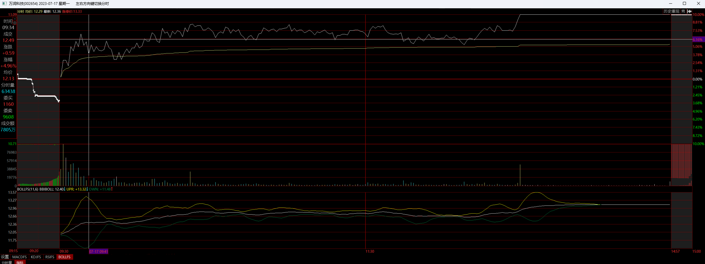
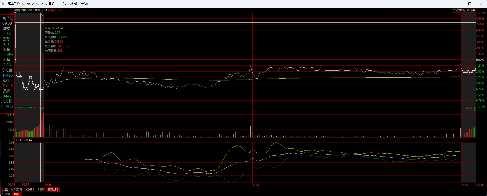
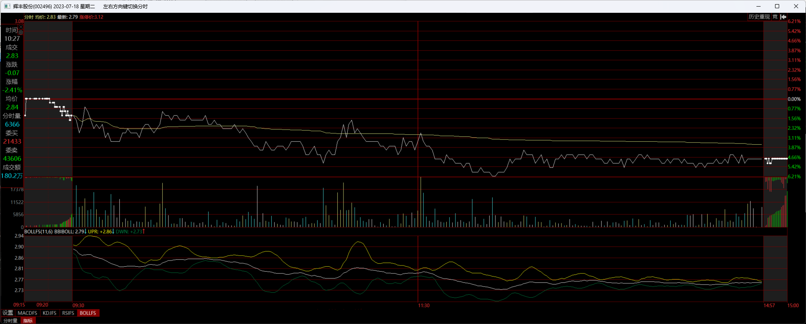
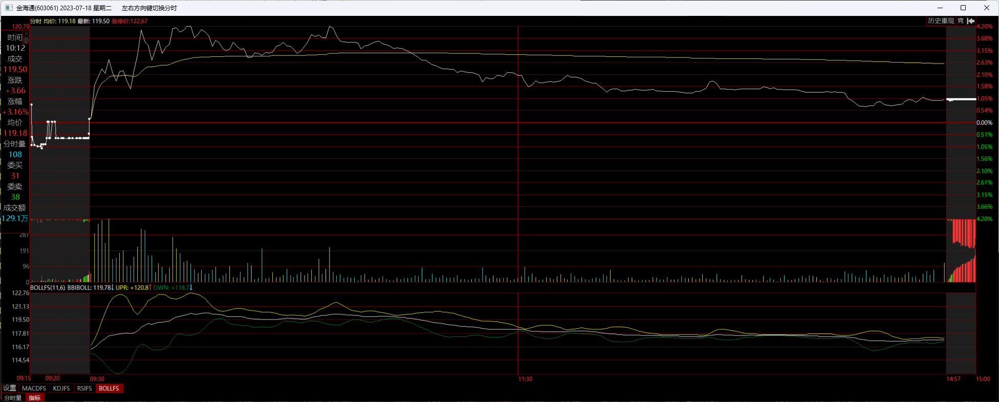

在说战法之前，必须介绍一下，我的超短之路。非常有幸，在2016年底刚准备学炒股的时候，遇到了一位非常热心的博主，向他学了许多知识。所以，刚起步的时候，就有了模式的概念，超短想赚钱，必须要有固定的打法以及灵活的运用，不能脚踩西瓜皮，天天临时起意。这些年，一路过来，我大概经历了

<font color='red'>中阴反包</font>

<font color='red'>中阳反包</font>

<font color='red'>烂板反包</font>

<font color='red'>大长腿转强</font>

<font color='red'>连板转强</font>

<font color='red'>龙头首阴</font>

<font color='red'>二板放量接力</font>

等等大约10余种模式的复盘与实战检验，最终发展到现在各模式间的灵活调配使用。今天要说的就是我依然还在使用的烂板反包模式。之所以说这个模式，是因为上周在实战中收获满满，有新鲜的案例

说案例


案例1：[万润科技](https://www.taoguba.com.cn/new/stockbar/barRedirect?stockName=万润科技)，2023年7月17日买入。

** 模式名称：烂板反包。效果：当天涨停，次日高开。


万润科技买入前一天是个烂板，尾盘最后一刻没有封住。

<font color='red'>烂板是当天碰到涨停但收盘没封住的</font>。如果是封住的都不叫烂板，那就是板。这种定义都是个人理解的定义，只是方便自己归类而已


7.14 买入前一天


7.17 当天买入 涨停




7.18 第二天 卖出


案例2：[众泰汽车](https://www.taoguba.com.cn/new/stockbar/barRedirect?stockName=众泰汽车)，2023年7月19日买入。模式名称：烂板反包。效果：当天涨停，次日高开。众泰汽车买入前一天也没有最终封住涨停，所以归为烂板


7.18 前一天


7.19 买入 <font color='red'>当天涨停</font>


7.20 卖出


<font color='red'>烂板反包的原理：其实很简单，当天涨停都封不住，次日是不是要下跌了？这是正常的情况。但是，有些票，它次日偏不，要反其道而行之，这就有些异常了，也就是重新转强。这就是做烂板反包的基础理论</font>


下面，分三大块内容说说烂板反包的实战


**一、备选股。**

烂板的备选股，自然是从烂板中来。那每天有多少只烂板呢？你不可能一只只去找，这不是麻烦的问题，是根本不现实，虽然碰过涨停，但收盘后涨幅千差万别，散落在5千多只票里，根本找不齐。


目前介绍两种找烂板的方法：

1、[同花顺](https://www.taoguba.com.cn/new/stockbar/barRedirect?stockName=同花顺)问财。

 

2、通达信电脑端公式选股。同花顺问财我不怎么用，因为它虽然智能，但总是会有偏差。比如我想找一下2023年7月21日的主板非ST烂板票有几只，它显示是五只


但其实并不止。因为我用通达信电脑端公式搜索出来的，是11只。比同花顺问财多了[华夏幸福](https://www.taoguba.com.cn/new/stockbar/barRedirect?stockName=华夏幸福)、[长久物流](https://www.taoguba.com.cn/new/stockbar/barRedirect?stockName=长久物流)、[通达创智](https://www.taoguba.com.cn/new/stockbar/barRedirect?stockName=通达创智)、[跨境通](https://www.taoguba.com.cn/new/stockbar/barRedirect?stockName=跨境通)。 <font color='red'>华远地产</font>  <font color='red'>普利制药</font>


```
选股公式
XG:H=ZTPRICE(REF(C,1),0.1) AND C<H;
```


多出来的四只，都符合烂板条件（盘中涨停过但收盘没有封涨停板），所以，同花顺问财是不全面的，不能用。另外，问财无法对任何历史一天的数据进行搜索，复盘不方便


**二、临盘决策。**

拿万润科技那一天来说，我可以复原一下历史。万润科技是周一买入，那么，7月14日周五的烂板有哪些，又是如何选中万润科技呢？我可以用公式搜索当天的烂板进行讲解


搜索后得出7月14日的烂板，主板共有以下17只：


当然，我们的万润科技也肯定在里面。
好，找到了所有的那天的烂板票，然后我们逐一来看，次日也就是7月17日他们的表现。在前面烂板原理的一段话中，我有表述过的就是，前一天烂板涨停都封不住，后一天却要转强，我们要找的就是这样的异常票。


那么，7月17号<font color='red'>开盘表现不是太强的票，我们就根本不用看了</font>。所以，一下子这17只中的范围就减少到只有几只了。这就是利用市场选择来做短线的基本原理。
7月17日开盘后强的有哪些呢：

[云赛智联](https://www.taoguba.com.cn/new/stockbar/barRedirect?stockName=云赛智联)、[林州重机](https://www.taoguba.com.cn/new/stockbar/barRedirect?stockName=林州重机)、[长江材料](https://www.taoguba.com.cn/new/stockbar/barRedirect?stockName=长江材料)、万润科技四只。


其实有几只还是高开的，但曾几何时，

<font color='red'>高开太多的烂板多数是坑，可能是量化惹的祸，建议少碰高开烂板票</font>


<font color='red'>梳理到现在，那就是四选一的问题了。判断哪些可以入，就要任何技术沉淀功底了。</font>


成本一般在4%以内

感觉烂板选股只是个开头，重头戏是如何从里面排除杂毛，可能得从个股股性和热门板块、人气等因子来选出当天能参与的票

选出的个股还得结合当时的板块热度和情绪来看


云赛智联 7-17 7-18

云赛智联是高开后还转强，<font color='red'>K线技术判断不会强</font> 一般来说我就不太看了，其实买入也能赚钱，但就怕坑。


林州重机  7-17 7-18


林州重机快速转强封板，是我没来的及买，手不够快。


长江材料的转强有些晚了些，其实也是好票，当天涨停了，但是子弹已经打光。

 长江材料 7-17  7-18


而万润科技恰到好处，即有气质，也有机会等同学们上车，次日高开3个点，算是不错的一单肉。


万润科技  7-17  7-18


这就是买入万润科技的来龙去脉


我的方法跟人家不一样，大多数人都是各种主观逻辑推演，行业逻辑，市场逻辑，还有什么相互制衡逻辑太多太复杂，我就是很简单的一个核心原则，

<font color='red'>资金让谁转强，我就跟随</font>

有些时候，我根本不知道买的票是什么概念，有时候还想不起来，今天买的票叫什么名称，反正就这样干了进去。比较直接的打法，要效率，不要前戏


7.17 竞价 没有选择的票

000561  烽火电子 


002496 辉丰股份







002558 巨人网络


002877 智能自控


600187 国中水务


601949 中国出版


603002 宏昌电子


603061 金海通





603278 大业股份


603798 康普顿


605589 圣泉集团


三、复盘。
复盘很重要。一个模式能不能用，哪些是会形成坑，只有记录对比后，才有比较明确的总结。盘感与经验都是枪杆子里得出来的。我一直也跟同学们说，抄作业并不是未来，而是形成自己的交易体系。当年复盘其中一个烂板模式，我就花了大半年的时候，从2018年复盘到2005年，10多年的每一天的烂板全部看过去，很笨辛苦，但好在我喜欢股票，不觉得累。


我只走自己的路，所以我根本不看别的博主，不是因为觉得他们水平不好，而是不想打破自己的思维体系，毕竟现在的体系已经还不错。如果这篇文章对你有用，记得实际行动鼓励一下哦


